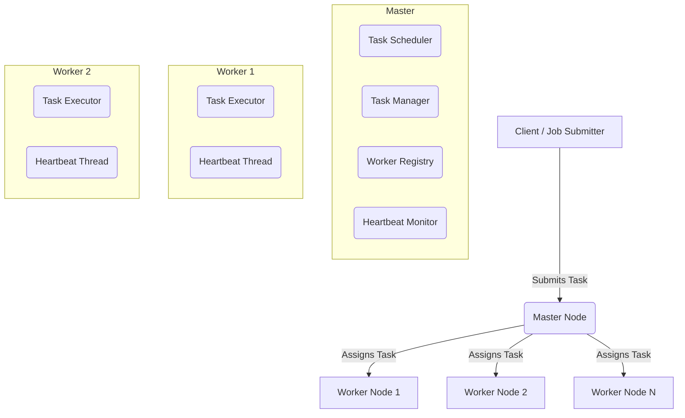
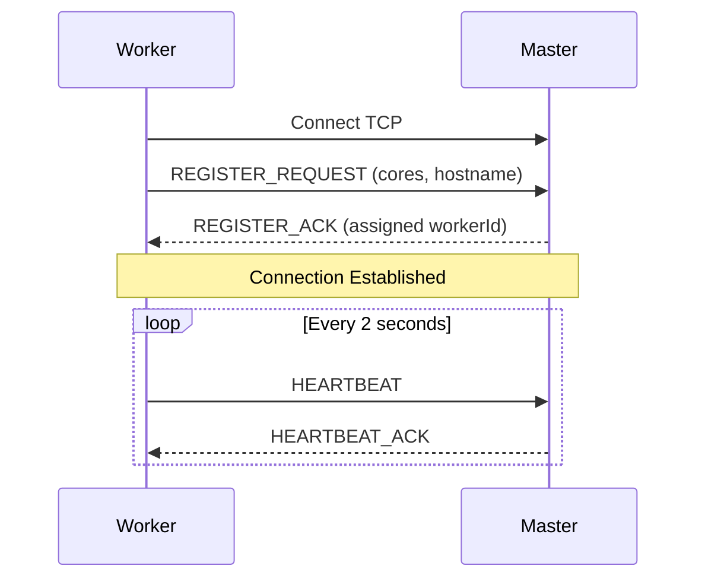
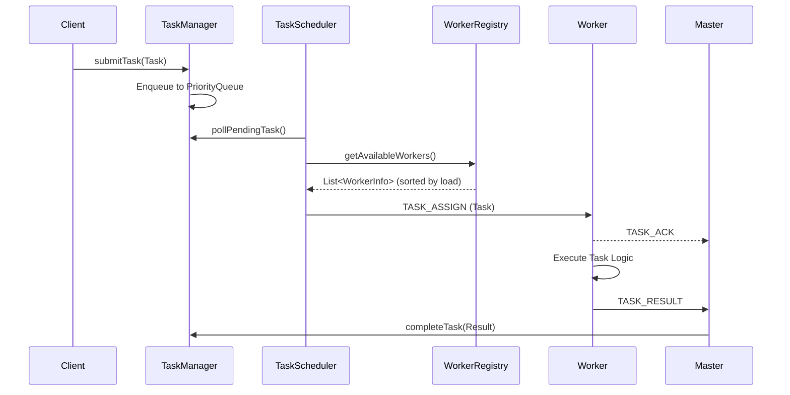
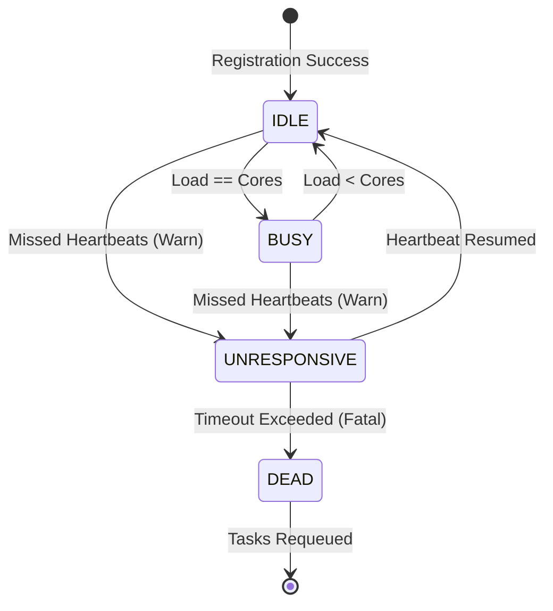
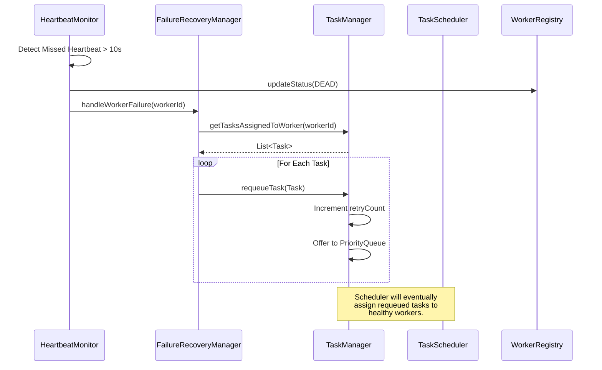

# Distributed Task Engine Architecture

This document provides a deep dive into the internal architecture, network communication, and fault-tolerance mechanisms of the Distributed Task Execution Engine.

---

## 1. High-Level Architecture

The system follows a classic Master-Worker topology where a single Master node acts as the coordinator and multiple Worker nodes execute tasks in parallel.

---

## 2. Communication Protocol

All communication between the Master and Workers occurs over long-lived TCP sockets using a custom binary framing protocol. 

**Wire Format:**
*   `[Length Prefix (4 Bytes)]` — Indicates the length of the serialized payload.
*   `[Payload (N Bytes)]` — The serialized `Message` object.

This length-prefix framing prevents the system from being vulnerable to Out-Of-Memory (OOM) attacks from malicious clients, as the `MessageCodec` enforces a strict 10MB `MAX_MESSAGE_SIZE_BYTES` limit before allocating heap memory.

---

## 3. Worker Registration & Initial Handshake

When a worker starts, it initiates a TCP connection to the master and attempts to register itself by broadcasting its hardware capabilities (e.g., available CPU cores).

---

## 4. Task Scheduling Lifecycle

The Master utilizes a push-based scheduling model. Instead of workers pulling tasks, the `TaskScheduler` runs on a dedicated thread and actively balances pending tasks across available workers using a load-factor metric `(Current Tasks / Available Cores)`.

---

## 5. Heartbeat & Failure Recovery

Resilience is guaranteed through continuous heartbeat monitoring. If a worker fails to send a heartbeat within the designated `deadThresholdMs`, the master reclaims its active tasks.

### 5.1 Worker Failure Redistribution

When a worker is marked `DEAD`, the `FailureRecoveryManager` immediately redistributes its active workload.

---

## 6. Secure Serialization

The Engine prevents classic Java deserialization attacks (like Arbitrary Code Execution) via a custom `SecureObjectInputStream`.

By overriding `resolveClass()`, the stream strictly whitelists valid package namespaces.
*   `com.engine.*` (Internal models)
*   `java.lang.*` (Primitives/Strings)
*   `java.util.*` (Collections)

Any unknown payload sent by a compromised worker is instantly blocked with a `SerializationException`.
